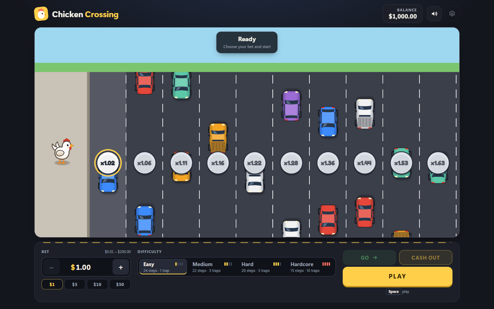

# Chicken Crossing

[Русский](README.md) · **English**

A step-by-step crash game in the style of Chicken Road. You place a bet, the chicken crosses a
road one lane at a time, and every lane it survives raises the multiplier. Cash out whenever
you like, or keep going and risk losing the bet to a car.

It runs entirely in the browser against a mock engine with a $1000 demo balance. There is no
backend and no real money.

Play it at https://NikolayYaroslavcev.github.io/chicken-crossing-pixi/.



## Stack

React 19, TypeScript, Vite, PixiJS 8, GSAP, Zustand and @pixi/sound. Tests use Vitest, Testing
Library and Playwright; linting and formatting use ESLint and Prettier.

## Running it

Requires Node 22 (see `.nvmrc`).

```sh
npm install
npm run dev        # dev server at http://localhost:5173/chicken-crossing-pixi/
npm run build      # typecheck and production build into dist/
npm run preview    # serve dist/ at http://localhost:4173/chicken-crossing-pixi/
```

## Game rules

- **Bet** between $0.01 and $200, with at most two decimals.
- **Difficulty** sets how many lanes there are and how dangerous they are:

  | Level    | Steps | First multiplier | Final multiplier |
  | -------- | ----- | ---------------- | ---------------- |
  | Easy     | 24    | x1.02            | x24.50           |
  | Medium   | 22    | x1.11            | x2,254.00        |
  | Hard     | 20    | x1.22            | x52,067.40       |
  | Hardcore | 15    | x1.63            | x3,203,384.80    |

- **Play** takes the bet and makes the first step straight away.
- **Step** (Go): the chicken hops onto the next lane. If it survives, the multiplier goes up.
- **Crash**: a car hits the chicken and the bet is lost.
- **Cash out** pays the bet times the current multiplier. It is available from the first
  survived lane on.
- **Finish**: surviving the last lane pays the level's top multiplier automatically.

Each level hides a fixed number of traps among 25 positions (1, 3, 5 and 10 from Easy to
Hardcore), and the number of steps is 25 minus the traps. The multiplier for step _k_ is
`0.98 / P(k)`, where `P(k)` is the chance of surviving _k_ steps, so every cash-out point has a
98% expected return. Multipliers and payouts are rounded down to the cent.

Keyboard: Space plays or takes the next step; Enter cashes out, or plays between rounds.

## Architecture

```text
React UI  →  Zustand store  →  Engine
                  ↓
              GameScene  →  PixiJS
```

- **Engine** (`src/engine`) is plain TypeScript. It owns the balance, validates bets and
  decides every outcome; the losing step is drawn from a seeded RNG when the round starts. It
  has no dependency on React, Pixi, Zustand, GSAP or sound, and an ESLint rule keeps it that
  way. `MockEngine` answers asynchronously with a short delay, behind the same `GameEngine`
  interface a server-backed engine would implement.
- **Store** (`src/store`) is a vanilla Zustand store that runs a round: it calls the engine,
  hands the result to the scene, waits for the animation, then updates its state. Input is
  locked while either is in progress. It only knows the scene through a small interface
  (`startRound`, `step`, `cashOut`, `reset`) and never touches Pixi objects. Balance, bet and
  difficulty are saved to `localStorage`.
- **Scene** (`src/game`) draws the road, chicken, traffic, camera and effects with PixiJS and
  GSAP. It is told what happened and animates it; it never decides an outcome. Traffic is
  decorative until the scene scripts a car for a crash the engine has already reported.
- **UI** (`src/ui`) is React: header, bet and difficulty controls, action buttons and the
  result panel. It reads the store and calls its actions. The canvas is mounted by
  `GameCanvas`, which also shows the loading and error states with a retry.
- **Sound** plays a click for accepted actions and cues for outcomes the scene shows. It has no
  say in a round, and missing audio files are skipped. Mute is saved separately from the game
  settings.

Rounds can't start until the renderer and sprite atlas are ready. A failed load or engine
call shows an error and leaves the game playable.

## Testing

```sh
npm test               # unit and integration tests (Vitest)
npm run test:e2e       # end-to-end tests (Playwright, Chromium)
npm run lint
npm run typecheck
npm run format:check
```

The e2e suite builds the app and serves it with `VITE_ENGINE_SEED=104`, so rounds are the same
on every run. Install the browser once with `npx playwright install chromium`. The tests run in
desktop Chromium, with phone, tablet and landscape layouts covered by viewport sizes; other
browsers and real devices are not part of the suite.

CI (`.github/workflows/ci.yml`) runs lint, format check, typecheck, unit tests and the build on
every push. Pushes to `main` then deploy the build to GitHub Pages.

## Assets

The sprite atlas and sound effects are original and generated from code in `scripts/`:

```sh
npm run assets:atlas   # needs the Playwright Chromium
npm run assets:audio
```

The multiplier font is Fredoka (SIL Open Font License 1.1) from `@fontsource-variable/fredoka`.
See [docs/assets.md](docs/assets.md) for the atlas layout, the sound list and licences.
